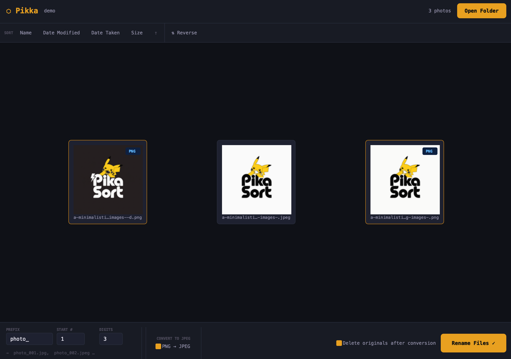

<p align="center">
  
</p>

<h1 align="center">Pikka</h1>

<p align="center">A minimal, dark-themed macOS desktop app for sorting and batch-renaming photos — built as a single Python file using PyQt6.</p>

---



---

## Overview

Pikka lets you drag a folder of photos into a visual grid, sort and reorder them, then rename them in one shot with a sequential prefix (`photo_001.jpg`, `photo_002.jpg`, …). Non-JPEG formats can be converted to JPEG on the fly during rename.

**Supported formats:** JPG, PNG, HEIC, WEBP, TIFF, BMP, GIF

**Key features:**

- Thumbnail grid with drag-to-reorder (live card shuffling as you drag)
- Sort by Name, Date Modified, Date Taken (EXIF), or File Size — ascending or descending
- Batch rename with sequential numbering and a configurable prefix
- Optional JPEG conversion for PNG, HEIC, WEBP, TIFF, BMP, and GIF files
- Rename confirmation dialog showing every old → new filename before committing
- Folder watching: a banner appears when files change on disk while the app is open
- Optional deletion of original files after conversion

---

## Requirements

- macOS
- Python 3.9+
- [PyQt6](https://pypi.org/project/PyQt6/)
- [Pillow](https://pypi.org/project/Pillow/)
- [piexif](https://pypi.org/project/piexif/)
- [watchdog](https://pypi.org/project/watchdog/) 

---

## Installation

```bash
# Clone the repo
git clone https://github.com/joeltanzu/Pikka.git
cd Pikka

# Install dependencies
pip install PyQt6 pillow piexif watchdog
```

---

## Usage

```bash
# Launch the app
python3 pikka.py

# Open with a folder pre-loaded
python3 pikka.py /path/to/photos
```

1. **Open a folder** — drag a folder onto the window, or click the folder button in the header.
2. **Sort** — use the sort toolbar to order by Name, Date Modified, Date Taken, or Size. Toggle ascending/descending with the arrow button.
3. **Reorder** — drag cards within the grid to set a custom order before renaming.
4. **Configure rename** — set a prefix in the bottom bar (default: `photo_`). Enable JPEG conversion for any non-JPEG formats shown in the conversion panel.
5. **Rename** — click **Rename**. A confirmation dialog lists every old → new filename. Confirm to apply.

---

## Running the app bundle (macOS Gatekeeper)

Pikka is unsigned, so macOS will block it on first launch. To open it:

**Option 1 — Right-click open (recommended)**
1. In Finder, right-click `Pikka.app`
2. Select **Open**
3. Click **Open** in the dialog that appears
4. macOS will remember your choice — subsequent launches work normally

**Option 2 — Remove the quarantine flag**
```bash
xattr -dr com.apple.quarantine dist/Pikka.app
```
Then double-click to open as usual.

> **Note:** This only applies to the built `.app` bundle (`dist/Pikka.app`). Running via `python3 pikka.py` directly is unaffected.

---

## License

MIT License.
